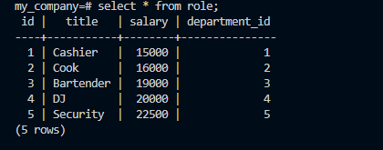

# SQL ET Employee Tracker


## Description
This application is for business owners that would like to view and manage different departments, roles, and employees in their company, so that they can organize and plan their business accordingly.

## Table of Contents
- [Installation](#Installation)
- [Usage](#Usage)
- [Contributing](#Contributing)
- [Links](#Links)
- [Questions](#Questions)
        
## Installation
Here are the npm packages you will need.
 1. Install npm inquirer
   ```sh
   npm i inquirer
   ```
2. Install npm  pg
   ```sh
   npm i pg
   ```

## Usage
In order to use the funtionality of this application you must have SQL Postgres and a Bash Terminal on your device. Here are some examples of what the app can provide.




## Contributing
Contributions are needed. Greatly appreciated. I'm always open to suggestions on how to make creations better.


## Link
Click the link for walk-through video.

## Questions
If you have any questions feel free to reach me at the following:
- Email: jacjalen16@gmail.com
